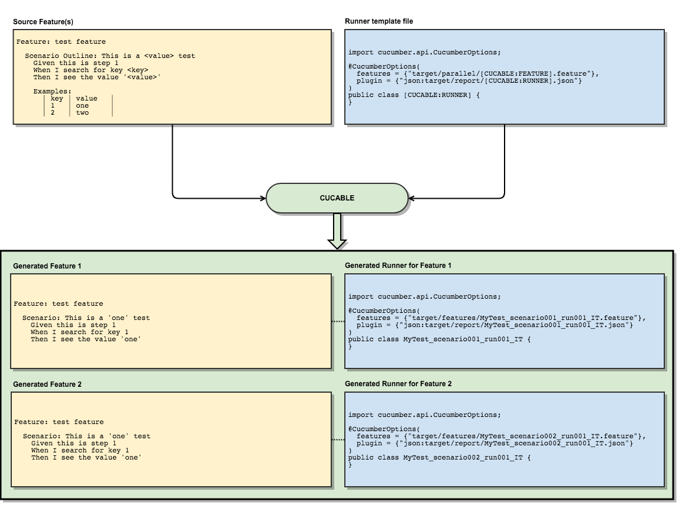
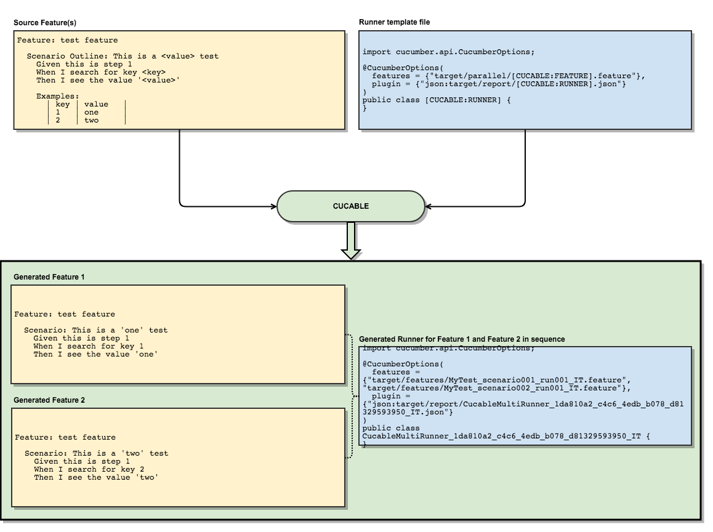

### Run Cucumber Scenarios in Parallel with Maven

[](http://www.apache.org/licenses/LICENSE-2.0)
[](http://repo1.maven.org/maven2/com/trivago/rta/cucable-plugin/)
[](https://travis-ci.org/trivago/cucable-plugin)
[](https://codecov.io/gh/trivago/cucable-plugin)
[](https://twitter.com/bischoffdev)


<!-- START doctoc generated TOC please keep comment here to allow auto update -->
<!-- DON'T EDIT THIS SECTION, INSTEAD RE-RUN doctoc TO UPDATE -->


- [Cucable Maven Plugin](#cucable-maven-plugin)
  - [Cucumber 4](#cucumber-4)
  - [Repository Structure](#repository-structure)
  - [Changelog](#changelog)
  - [Maven dependency](#maven-dependency)
- [How it works](#how-it-works)
  - [Template placeholders](#template-placeholders)
    - [[CUCABLE:RUNNER]](#cucablerunner)
    - [[CUCABLE:FEATURE]](#cucablefeature)
    - [Custom template placeholders - [CUCABLE:CUSTOM:xxx]](#custom-template-placeholders---cucablecustomxxx)
  - [One runner per generated scenario](#one-runner-per-generated-scenario)
  - [One runner per group of generated scenarios](#one-runner-per-group-of-generated-scenarios)
- [Typical workflow](#typical-workflow)
  - [1. Generation of runners and features](#1-generation-of-runners-and-features)
    - [Required Parameters](#required-parameters)
      - [sourceRunnerTemplateFile](#sourcerunnertemplatefile)
        - [Using a java file as a runner template](#using-a-java-file-as-a-runner-template)
        - [Using a text file as a runner template](#using-a-text-file-as-a-runner-template)
      - [sourceFeatures](#sourcefeatures)
      - [generatedFeatureDirectory](#generatedfeaturedirectory)
      - [generatedRunnerDirectory](#generatedrunnerdirectory)
    - [Optional Parameters](#optional-parameters)
      - [numberOfTestRuns](#numberoftestruns)
      - [includeScenarioTags](#includescenariotags)
      - [parallelizationMode](#parallelizationmode)
      - [logLevel](#loglevel)
      - [desiredNumberOfRunners](#desirednumberofrunners)
      - [desiredNumberOfFeaturesPerRunner](#desirednumberoffeaturesperrunner)
      - [scenarioNames](https://github.com/josepj/cucable-plugin/blob/master/README.md#scenarionames)
    - [Generating runners and features inside target directory](#generating-runners-and-features-inside-target-directory)
    - [Complete Example](#complete-example)
      - [Source feature file](#source-feature-file)
      - [Runner template file](#runner-template-file)
      - [Generated Scenarios](#generated-scenarios)
      - [Generated runners](#generated-runners)
  - [2. Running the generated tests with Maven failsafe](#2-running-the-generated-tests-with-maven-failsafe)
  - [3. Aggregation of a single test report after all test runs](#3-aggregation-of-a-single-test-report-after-all-test-runs)
- [Example project](#example-project)
- [Appendix](#appendix)
  - [Building](#building)
  - [License](#license)
  - [Credits](#credits)

<!-- END doctoc generated TOC please keep comment here to allow auto update -->

# Cucable Maven Plugin

Cucable is a Maven plugin for [Cucumber](https://cucumber.io) scenarios that simplifies fine-grained and efficient parallel test runs.

This plugin does the following:

- Generate single [Cucumber](https://cucumber.io) features containing one single scenario each (scenario outlines are also split up into separate scenarios)
- Generating [Cucumber](https://cucumber.io) runners 
  - for every generated "single scenario" feature file or
  - for multiple generated "single scenario" feature files

Those generated runners and features can then be used with [Maven Failsafe](http://maven.apache.org/surefire/maven-failsafe-plugin/) in order to parallelize test runs.

This also works for **non-english** feature files!

## Cucumber 4

Even though Cucumber 4 supports basic parallel runs, Cucable has more options that may be beneficial for your use case:

* It supports running single scenarios, complete features or sequences of single scenarios in parallel
* It supports splitting scenarios and attaching them to a fixed number of runners
* It supports splitting scenarios and attaching batches of them to a dynamic number of runners
* You don't need any test framework changes because Cucable runs before the framework invocations
* You have full control over your runners because of template variables and custom placeholders

## Repository Structure

* [plugin-code](plugin-code) contains the full plugin source code.
* [example-project](example-project) contains an example Maven project to see the plugin in action.

## Changelog

All changes are documented in the [full changelog](CHANGELOG.md).

## Maven dependency

```xml
<dependency>
    <groupId>com.trivago.rta</groupId>
    <artifactId>cucable-plugin</artifactId>
    <version>(check version on top of the page)</version>
</dependency>
```

# How it works

* Cucable will cut up feature file into the smallest possible runnable scenarios
* Each generated feature file includes a single scenario
* After this, the runner classes for those generated features are generated based on a provided template file, either
  * one runner per generated "single scenario" feature file or
  * one runner per group of "single scenario" feature files

## Template placeholders

### [CUCABLE:RUNNER]

The `[CUCABLE:RUNNER]` template placeholder is automatically replaced with the class name of the generated runner class.

If the generated runner runs only one "single scenario" feature, its name will be the same as the generated feature (e.g. `MyFeature_scenario001_run001_IT`).

In case the runner runs multiple "single scenario" features, its name will be auto-generated (e.g. `CucableMultiRunner_1da810a2_c4c6_4edb_b078_d81329593950_IT`).

### [CUCABLE:FEATURE]

The `[CUCABLE:FEATURE]` can be placed in the `feature` option of the `@CucumberOptions` block in your template:

<pre>
@CucumberOptions(
  features = {<b>"target/parallel/features/<b>[CUCABLE:FEATURE]</b>.feature"</b>}
)
</pre>

Cucable will automatically detect the string containing the `[CUCABLE:FEATURE]` placeholder and use this to generate one line for each feature this runner should trigger.

### Custom template placeholders - [CUCABLE:CUSTOM:xxx]

In some cases, you may need to set custom values that should be written to your template files.

In this case, just add a block to your POM file:

```
<customPlaceholders>
    <somename>Any value</somename>
    <foo>bar</foo>
</customPlaceholders>

```

These custom placeholders can be used anywhere in your template:

<pre>
import cucumber.api.CucumberOptions;

@CucumberOptions(
        features = {"target/parallel/features/[CUCABLE:FEATURE].feature"},
        plugin = {"json:target/cucumber-report/<b>[CUCABLE:CUSTOM:foo]</b>.json"}
)
public class [CUCABLE:RUNNER] {
    // <b>[CUCABLE:CUSTOM:somename]</b>
}
</pre>

In this case the result would be

<pre>
import cucumber.api.CucumberOptions;

@CucumberOptions(
        features = {"target/parallel/features/[CUCABLE:FEATURE].feature"},
        plugin = {"json:target/cucumber-report/<b>bar</b>.json"}
)
public class [CUCABLE:RUNNER] {
    // <b>Any value</b>
}
</pre>

**Note:** The custom placeholder names are case sensitive!

## One runner per generated scenario

This is the default mode of Cucable. Having multiple runners that run one "single scenario" feature each is best for parallelization with [Maven Failsafe](http://maven.apache.org/surefire/maven-failsafe-plugin/).



## One runner per group of generated scenarios

If you use the `desiredNumberOfRunners` or `desiredNumberOfFeaturesPerRunner` option, Cucable will automatically switch to the multi-feature runner mode.

This means that it will only generate the specified number of runners (or features per runner) and distribute the generated features evenly among the runners. This is helpful if a group of scenarios should be executed during each forked run of your test framework.

**Note:** If a runner runs only one feature, it automatically has the same name as the feature. Otherwise it will have a unique auto-generated name.



# Typical workflow

1. Generation of runners and features
2. Running the generated tests with [Maven Failsafe](http://maven.apache.org/surefire/maven-failsafe-plugin/)
3. Aggregation of a single test report after all test runs

The following sections break down the above steps.

## 1. Generation of runners and features

```xml
<plugin>
    <groupId>com.trivago.rta</groupId>
    <artifactId>cucable-plugin</artifactId>
    <version>${cucable-plugin.version}</version>
    <executions>
        <execution>
            <id>generate-test-resources</id>
            <phase>generate-test-resources</phase>
            <goals>
                <goal>parallel</goal>
            </goals>
        </execution>
    </executions>
    <configuration>
        <!-- Required properties -->
        <sourceRunnerTemplateFile>src/test/resources/parallel/cucable.template</sourceRunnerTemplateFile>
        <sourceFeatures>src/test/resources/features</sourceFeatures>
        <generatedFeatureDirectory>src/test/resources/parallel/features</generatedFeatureDirectory>
        <generatedRunnerDirectory>src/test/java/parallel/runners</generatedRunnerDirectory>
        
        <!-- Optional properties -->
        <numberOfTestRuns>1</numberOfTestRuns>
        <includeScenarioTags>@includeMe and @includeMeAsWell</includeScenarioTags>                                
        <logLevel>compact</logLevel>
        
        <desiredNumberOfRunners>2</desiredNumberOfRunners>                                
        <!-- or <desiredNumberOfFeaturesPerRunner>5</desiredNumberOfRunners> -->
    </configuration>    
</plugin>
```

### Required Parameters

#### sourceRunnerTemplateFile

The specified file will be used to generate runner classes for the generated feature file that can be run using [Maven Failsafe](http://maven.apache.org/surefire/maven-failsafe-plugin/).

This can be either a text file or a Java class. The difference can be seen below:

##### Using a java file as a runner template

If you use a java file (e.g. _src/test/java/some/template/CucableJavaTemplate.java_), the **[CUCABLE:FEATURE]** placeholder as well as the **class name** will be substituted for the generated feature file name(s).
The **[CUCABLE:RUNNER]** placeholder will be replaced by the runner class name.

Additionally, the **package declaration** will be stripped.

_Example:_

<pre>
<b>package some.template;</b>

import cucumber.api.CucumberOptions;

@CucumberOptions(
        features = {"target/parallel/features/<b>[CUCABLE:FEATURE]</b>.feature"},
        plugin = {"json:target/cucumber-report/<b>[CUCABLE:RUNNER]</b>.json"}
)
public class CucableJavaTemplate {

}
</pre>

will turn into

<pre>
import cucumber.api.CucumberOptions;

@CucumberOptions(
        features = {<b>"target/parallel/features/MyFeature_scenario001_run001_IT.feature"</b>},
        plugin = {"json:target/cucumber-report/<b>MyFeature_scenario001_run001_IT</b>.json"}
)
public class <b>MyFeature_scenario001_run001_IT</b> {
}

// Generated by Cucable from src/test/java/some/template/CucableJavaTemplate.java
</pre>

In case of a fixed number of runners that contain multiple scenarios (via `desiredNumberOfRunners` property), the runner name will be auto-generated:

<pre>
import cucumber.api.junit.Cucumber;
import cucumber.api.CucumberOptions;
import org.junit.runner.RunWith;

@RunWith(Cucumber.class)
@CucumberOptions(
    features = {<b>"target/parallel/features/Bookmarks_scenario001_run001_IT.feature",
"target/parallel/features/Bookmarks_scenario003_run001_IT.feature"</b>},
    plugin = {
        "json:target/cucumber-report/<b>CucableMultiRunner_1da810a2_c4c6_4edb_b078_d81329593950_IT</b>.json",
        "com.trivago.trupi.plugin.TrupiCucumberPlugin"
    },
    glue = {"com.trivago.trupi.glue"}
)
public class <b>CucableMultiRunner_1da810a2_c4c6_4edb_b078_d81329593950_IT</b> {
}

// Generated by Cucable from src/test/java/some/template/CucableJavaTemplate.java
</pre>

##### Using a text file as a runner template

If you use a text file (e.g. _src/test/resources/cucable.template_), all **[CUCABLE:FEATURE]** placeholder will be substituted for the generated feature file name(s). The **[CUCABLE:RUNNER]** placeholder will be replaced by the runner class name.

#### sourceFeatures

This can specify
* the root path of your __existing__ [Cucumber](https://cucumber.io) _.feature_ files (e.g. ```src/test/resources/features```)
* the path to a specific __existing__ [Cucumber](https://cucumber.io) _.feature_ file (e.g. ```src/test/resources/features/MyFeature.feature```)
* the path to a specific __existing__ [Cucumber](https://cucumber.io) _.feature_ file including line numbers of specific scenarios/scenario outlines inside this file (e.g. ```src/test/resources/features/MyFeature.feature:12:19``` would only convert the scenarios starting at line _12_ and _19_ inside _MyFeature.feature_)

**Note:** From Cucable 1.4.0 onwards it is possible to specify a combination as a comma separated list:

```xml
<sourceFeatures>
    src/test/resources/features/sometests,
    src/test/resources/features/MyFeature.feature:8:15
</sourceFeatures>
```

This example would process all features in the `src/test/resources/features/sometests` directory **and** scenarios at lines 8 and 15 of `src/test/resources/features/MyFeature.feature`.

#### generatedFeatureDirectory

The path where the __generated__ [Cucumber](https://cucumber.io) .feature files should be located (e.g. _src/test/resources/parallel_).

**Note:** This directory should be located under a valid resource folder to be included as a test source by Maven.
If you want to use a directory inside Maven's target folder, [check this example](#generating-runners-and-features-inside-target-directory).

**Caution:** This directory will be wiped prior to the feature file generation!

#### generatedRunnerDirectory

The path where the __generated__ runner classes should be located (e.g. _src/test/java/parallel/runners_).

**Note:** This directory should be located under a valid source folder to be included as a test source by Maven.
If you want to use a directory inside Maven's target folder, [check this example](#generating-runners-and-features-inside-target-directory).

**Caution:** This directory will be wiped prior to the runner file generation!

### Optional Parameters

#### numberOfTestRuns

Optional number of test runs. This can be used if specific scenarios should be run multiple times.
If this options is not set, its default value is __1__.

For each test run, the whole set of features and runners is generated like this:

- MyFeature_scenario001_run001_IT.feature
- MyFeature_scenario001_run002_IT.feature
- MyFeature_scenario001_run003_IT.feature
- etc.

**Note:** Characters other than letters from A to Z, numbers and underscores will be stripped out of the feature file name.

#### includeScenarioTags

`includeScenarioTags` can be used to provide a [Cucumber tag expression](https://docs.cucumber.io/cucumber/api/#tag-expressions) in order to specify which tags should be included or excluded from scenario generation:

__Example:__ include scenarios that are tagged with _@scenario1_:
```xml
<includeScenarioTags>@scenario1</includeScenarioTags>
```

__Example:__ include scenarios that are tagged with _@scenario1_ __or__ _@scenario2_:
```xml
<includeScenarioTags>@scenario1 or @scenario2</includeScenarioTags>
```

__Example:__ include scenarios that are tagged with _@scenario1_ __and__ _@scenario2_:
```xml
<includeScenarioTags>@scenario1 and @scenario2</includeScenarioTags>
```

__Example:__ include scenarios that are __not__ tagged with _@scenario1_:
```xml
<includeScenarioTags>not @scenario1</includeScenarioTags>
```

__Example:__ include scenarios that are __not__ tagged with _@scenario1_ but tagged with _scenario2_ __or__ _scenario3_:
```xml
<includeScenarioTags>not @scenario1 and (@scenario2 or scenario3)</includeScenarioTags>
```

#### parallelizationMode

By default, Cucable uses the `parallelizationMode = scenarios` meaning that feature files are split into individual scenarios that each have a dedicated runner.

Sometimes it may be desirable, to parallelize complete features. When setting the `parallelizationMode = features`, only complete features containing all of their source scenarios are generated so __each runner runs a complete feature__.

```xml
<parallelizationMode>features</parallelizationMode>
```

__Note:__ For this mode to work, `<sourceFeatures>` must specify a directory. Also, `includeScenarioTags` cannot be used. 

#### logLevel

By default, Cucable logs all information including

* its own name and version
* all passed property values
* a list of processed feature paths

This can be configured by passing the `logLevel` property:

```
<logLevel>default|compact|minimal|off</logLevel>
```

* _default_ will log all the mentioned information
* _compact_ will only log the plugin name, version, properties and one line of summary
* _minimal_ will only log a summary line
* _off_ will prevent any logging

#### desiredNumberOfRunners

If you set this options, all generated features will be distributed to a fixed set of runner classes. This means that one runner can potentially run multiple features in sequence.

If this option is not set, its default value is `0` which basically means "Generate a dedicated runner for every generated feature".

__Note:__ This cannot be used together with `desiredNumberOfFeaturesPerRunner`!

#### desiredNumberOfFeaturesPerRunner

If you set this option, all generated features will be distributed to a dynamic set of runner classes so that every runner contains a fixed number of generated features. This means that one runner can potentially run multiple features in sequence.

If this option is not set, its default value is `0` which basically means "Generate a dedicated runner for every generated feature".

__Note:__ This cannot be used together with `desiredNumberOfRunners`!

#### scenarioNames

A comma separated list of strings matching a scenario name, either completely or partially. Please see "--name" in Cucumber command-line options ("java cucumber.api.cli.Main --help" or "mvn test -Dcucumber.options="--help""). If you set this option, only scenarios matching the specified names will be loaded into the generated runners. The number of runner files will default to the number of scenario names and each runner file will contain the scenarios matching 1 name. Please note that this will override `desiredNumberOfRunners`.
For example, if the following scenario names are specified:
```xml
<scenarioNames>
    name1,
    name2
</scenarioNames>
```
2 runner files will be generated. The first file will contain all the scenarios matching `name1` and the second file will contain all the scenarios matching `name2`.

__Note:__ This cannot be used together with `desiredNumberOfFeaturesPerRunner`!

### Generating runners and features inside target directory

It may be desirable for you to generate the Cucable features and runners in Maven's `target` directory.
The advantage of this is that this directory is wiped by the `mvn clean` command and older generated files do not reside in your `src` directory.

In order to achieve this, you can specify subdirectories under target (`${project.build.directory}`) for Cucable, e.g. `${project.build.directory}/parallel/runners` and `${project.build.directory}/parallel/features`

After this step, use the *build-helper-maven-plugin* in your POM file in order to consider the generated runner classes test sources:

```xml
<plugins>
    <plugin>
        <groupId>com.trivago.rta</groupId>
        <artifactId>cucable-plugin</artifactId>
        <version>${cucable.plugin.version}</version>
        <executions>
            <execution>
                <id>generate-test-resources</id>
                <phase>generate-test-resources</phase>
                <goals>
                    <goal>parallel</goal>
                </goals>
            </execution>
        </executions>
        <configuration>
            <sourceRunnerTemplateFile>path_to_template_file</sourceRunnerTemplateFile>
            <sourceFeatures>path_to_features</sourceFeatures>
            <generatedFeatureDirectory>${project.build.directory}/parallel/features</generatedFeatureDirectory>
            <generatedRunnerDirectory>${project.build.directory}/parallel/runners</generatedRunnerDirectory>
        </configuration>    
    </plugin>
    <plugin>
        <groupId>org.codehaus.mojo</groupId>
        <artifactId>build-helper-maven-plugin</artifactId>
        <version>${build.helper.plugin.version}</version>
        <executions>
            <execution>
                <id>add-test-source</id>
                <phase>generate-test-sources</phase>
                <goals>
                    <goal>add-test-source</goal>
                </goals>
            </execution>
        </executions>
        <configuration>
            <sources>
                <source>${project.build.directory}/parallel/runners</source>
            </sources>
        </configuration>    
    </plugin>
</plugins>

```

### Complete Example

Below, you can see a full example of what Cucable does.

#### Source feature file

This is our source feature file. It contains a scenario and a scenario outline with two examples.

*MyFeature.feature*
```
Feature: This is the feature name

    Scenario: First scenario
        Given I am on the start page
        And I click the login button
        Then I see an error message

    Scenario Outline: Second scenario with an amount of <amount>
        Given I am on the start page
        And I add <amount> items
        And I navigate to the shopping basket
        Then I see <amount> items
        Examples:
            | amount |
            | 12     |
            | 85     |
```

#### Runner template file

This is the runner template file (in this example we use a text file) that is used to generate single scenario runners.

* The placeholder **[CUCABLE:FEATURE]** and its enclosing string will be replaced with the generated feature names by Cucable.
* The placeholder **[CUCABLE:RUNNER]** will be replaced with the generated runner class name by Cucable.

<pre>
import cucumber.api.CucumberOptions;

@CucumberOptions(
        features = {"target/parallel/features/<b>[CUCABLE:FEATURE]</b>.feature"},
        plugin = {"json:target/cucumber-report/<b>[CUCABLE:RUNNER]</b>.json"}
)
public class <b>[CUCABLE:RUNNER]</b> {
}
</pre>

**Note:** The specified _plugin_ generates Cucumber JSON files which are needed for custom aggregated test reports.

#### Generated Scenarios

For each scenario, a single feature file is created: 

*MyFeature_scenario001_run001_IT.feature*

```
Feature: This is the feature name

Scenario: First scenario
Given I am on the start page
And I click the login button
Then I see an error message
```

Note that for the scenario outlines, each example is converted _to its own scenario and feature file_:

*MyFeature_scenario002_run001_IT.feature*

<pre>
Feature: This is the feature name

Scenario: Second scenario with an amount of <b>12</b>
Given I am on the start page
And I add <b>12</b> items
And I navigate to the shopping basket
Then I see <b>12</b> items
</pre>

*MyFeature_scenario003_run001_IT.feature*

<pre>
Feature: This is the feature name

Scenario: Second scenario with an amount of <b>85</b>
Given I am on the start page
And I add <b>85</b> items
And I navigate to the shopping basket
Then I see <b>85</b> items
</pre>

#### Generated runners

The generated runners point to each one of the generated feature files (unless you use the `desiredNumberOfRunners` or `desiredNumberOfFeaturesPerRunner` option).

This is an example for one of the generated runners - note how the placeholders are now replaced with the name of the feature to run:

*MyFeature_scenario001_run001_IT.java*

<pre>
import cucumber.api.CucumberOptions;

@CucumberOptions(
        features = {"target/parallel/features/<b>MyFeature_scenario001_run001_IT</b>.feature"},
        plugin = {"json:target/cucumber-report/<b>MyFeature_scenario001_run001_IT</b>.json"}
)
public class <b>MyFeature_scenario001_run001_IT</b> {
}
</pre>

## 2. Running the generated tests with Maven failsafe

This will skip the unit tests (if any) and run the generated runner classes with [Maven Failsafe](http://maven.apache.org/surefire/maven-failsafe-plugin/).
Since all generated runner classes from the step before end with ___IT__, they are automatically considered integration tests and run with [Maven Failsafe](http://maven.apache.org/surefire/maven-failsafe-plugin/).

**Note:** If all tests should be run regardless of their result, it is important to set ```<testFailureIgnore>true</testFailureIgnore>``` for [Maven Failsafe](http://maven.apache.org/surefire/maven-failsafe-plugin/) - otherwise the plugin execution will stop on failing tests.
However, if this is specified, the build will not fail in case of failing tests!

To circumvent that, it is possible to specify a custom [rule](https://maven.apache.org/enforcer/enforcer-api/writing-a-custom-rule.html) for [Maven enforcer](https://maven.apache.org/enforcer/maven-enforcer-plugin/) that passes or fails the build depending on custom conditions.

```xml
<plugins>
    <plugin>
        <groupId>org.apache.maven.plugins</groupId>
        <artifactId>maven-surefire-plugin</artifactId>
        <configuration>
            <skipTests>true</skipTests>
        </configuration>
    </plugin>
    <plugin>
        <groupId>org.apache.maven.plugins</groupId>
        <artifactId>maven-failsafe-plugin</artifactId>
        <executions>
            <execution>
                <id>Run parallel tests</id>
                <phase>integration-test</phase>
                <goals>
                    <goal>integration-test</goal>
                </goals>
            </execution>
        </executions>
        <configuration>
            <testFailureIgnore>true</testFailureIgnore>
            <forkCount>${maven.fork.count}</forkCount>
            <reuseForks>false</reuseForks>
            <argLine>-Dfile.encoding=UTF-8</argLine>
            <disableXmlReport>true</disableXmlReport>
        </configuration>
    </plugin>
</plugins>
```

## 3. Aggregation of a single test report after all test runs

We use the [Cluecumber](https://github.com/trivago/cluecumber-report-plugin) plugin to aggregate all generated __.json__ report files into one overall test report.

```xml
<plugins>
    <plugin>
        <groupId>com.trivago.rta</groupId>
        <artifactId>cluecumber-report-plugin</artifactId>
        <version>${cluecumber.report.version}</version>
        <executions>
            <execution>
                <id>report</id>
                <phase>post-integration-test</phase>
                <goals>
                    <goal>reporting</goal>
                </goals>
            </execution>
        </executions>
        <configuration>
            <sourceJsonReportDirectory>${project.build.directory}/cucumber-report</sourceJsonReportDirectory>
            <generatedHtmlReportDirectory>${project.build.directory}/test-report</generatedHtmlReportDirectory>
        </configuration>    
    </plugin>
</plugins>
```

# Example project

You can test the complete flow and POM configuration by checking out the [Cucable example project](example-project).

# Appendix

## Building

Cucable requires Java >= 8 and Maven >= 3.3.9.
It is available in [Maven central](https://search.maven.org/#search%7Cgav%7C1%7Cg%3A%22com.trivago.rta%22%20AND%20a%3A%22cucable-plugin%22).

## License

Copyright 2017 [trivago N.V.](https://www.trivago.de/impressum)

Licensed under the Apache License, Version 2.0 (the "License"); you may not use this file except in compliance with the License. You may obtain a copy of the License at

http://www.apache.org/licenses/LICENSE-2.0

Unless required by applicable law or agreed to in writing, software distributed under the License is distributed on an "AS IS" BASIS, WITHOUT WARRANTIES OR CONDITIONS OF ANY KIND, either express or implied. See the License for the specific language governing permissions and limitations under the License.

## Credits

This plugin was inspired by the [Cucumber Slices Maven Plugin](https://github.com/DisneyStudios/cucumber-slices-maven-plugin).
